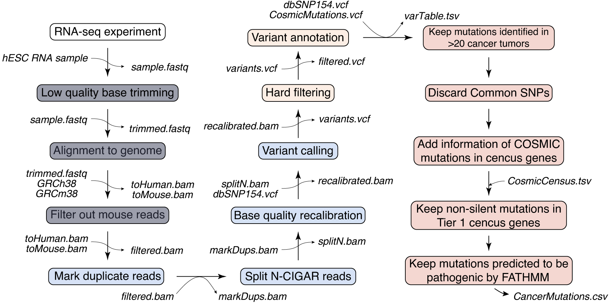

# RNA2CaM

RNA2CaM is a tool for the identification of cancer-related mutations from RNA-seq data


## Pre-requisites 

Nextflow and Docker (or Singularity for execution on SLURM-clusters) are the only pre-requisites for the RNA2CM tool. Install both if needed and make sure they are properly running on your system. If the following commands do not generate any error message you are good to go.
```bash
nextflow run hello  # test that nextflow is working
docker run hello-world  # test that docker is working if you are working on a local workstation
singularity help  # test that singularity is working in case your are working on a SLURM cluster
```

## Installation

1. Download the project directory:
```bash
git clone https://github.com/elyadlezmi/RNA2CM.git  # clone the project using git
```

2. Download the files CosmicMutantExportCensus.tsv.gz and CosmicCodingMuts.vcf.gz from the COSMIC website (https://cancer.sanger.ac.uk/cosmic/download, login required), then move both files into the project’s subdirectory named data (RNA2CM/data).

3. Execute the script named setup.nf which is responsible for setting up all the reference data and will complete the installation (this might take a while).
```bash
nextflow run /path/to/RNA2CM/setup.nf  # run the installation script
```
The setup.nf script can take three optional arguments:

-profile: Choose the executor profile between a standard dockerized usage on a local workstation or usage on a SLURM cluster (requires Singularity instead of Docker) (standard/cluster, default: standard).

--cpu: The number of threads for multi-threading (int, default 8).

--readLength: The expected Illumina read length for optimal alignment by STAR (int, default 100).

## Usage

```bash
nextflow run /path/to/RNA2CM --fastq your_sample.fastq.gz  # for single-end reads
nextflow run /path/to/RNA2CM --fastq your_sample_1.fastq.gz --fastq2 your_sample_2.fastq.gz  # for paired-ends reads
```
Optional arguments (Note that the only required arguments are RNA-seq reads, output is generated into the working directory):

-profile: (standard/cluster, default: standard).

--cpu: (int, default 8).

--prefix: the prefix that will be given to output files (str)

--keepInter: Whether to keep intermediate alignment and VCF files (true/false, default: false). 

--filterMouse: Whether to perform mouse contamination cleanup (true/false, default true).

Example for a paired-ends RNA-seq run, using 4 CPUs, keeping intermediate files:
```bash
nextflow run /path/to/RNA2CM --fastq esc_1.fastq.gz --fastq2 esc_2.fastq.gz --cpu 4 --keepInter true 
```

Example for a single-end RNA-seq run, skipping mouse read filtration and running on a SLURM cluster (nextflow manages batch jobs, so no need to use sbatch):
```bash
nextflow run /path/to/RNA2CM --fastq SRR1234567.fastq.gz --filterMouse false -profile cluster
```
